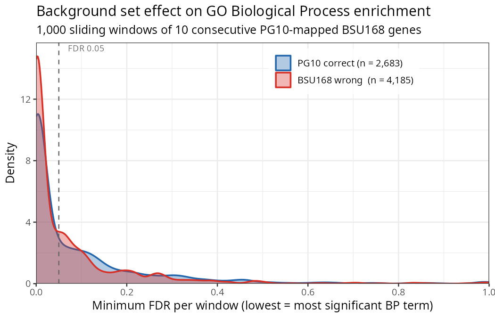
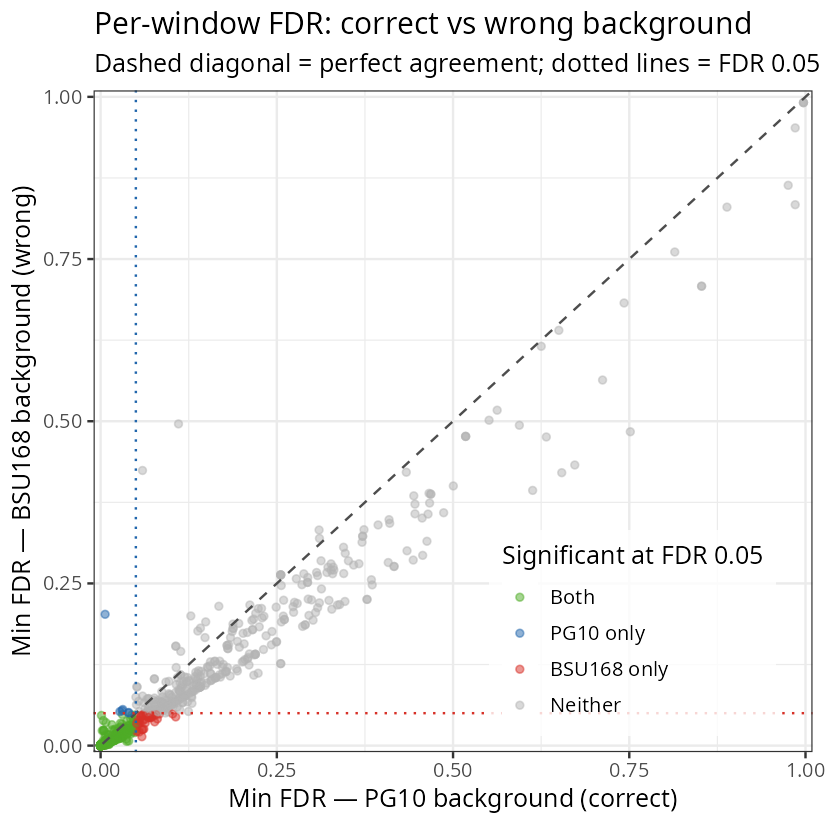
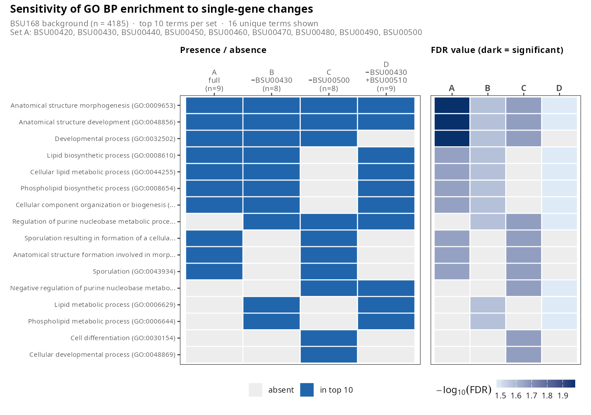

# BsubtilisGO

A Shiny web application for Gene Ontology (GO) enrichment analysis of *Bacillus subtilis* gene sets, designed for wet-lab biologists working with strains other than the standard reference.

**Live app: [https://vierakovacova.shinyapps.io/BsubtilisGO/](https://vierakovacova.shinyapps.io/BsubtilisGO/)**

---

## Motivation

In genetically diverse bacterial species, technical biases in read mapping and annotation can propagate into apparently robust biological conclusions at the pathway or Gene Ontology (GO) level [**REF**](https://journals.plos.org/plosone/article?id=10.1371/journal.pone.0180904). This problem is particularly pronounced when RNA-seq reads are aligned to a non-matching reference genome, where differences in genome content, gene architecture, or sequence polymorphism distort read assignment and downstream differential expression quantification.

Within *Bacillus subtilis*, the domesticated reference strain 168 harbours genomic features and regulatory adaptations absent from streamlined isolates such as PG10, whose reduced genome reflects extensive gene loss and niche adaptation [**REF**](https://genome.cshlp.org/content/early/2017/01/23/gr215293116). Similarly, rapidly evolving pathogens such as *Mycobacterium tuberculosis* accumulate strain-specific polymorphisms and structural variation that alter mapping efficiency and expression estimates when reads are aligned to a divergent reference [**REF**](https://elifesciences.org/reviewed-preprints/97870v2).

These effects may appear subtle at the individual gene level, where expression shifts are often close to statistical thresholds. GO enrichment analyses amplify such perturbations because enrichment statistics depend strongly on both the exact composition of the differentially expressed gene set and the chosen background universe. Consequently, adding or removing a single borderline-significant gene — as can happen at an FDR cutoff of 0.05 — may qualitatively alter the enriched biological interpretation. Equally, an inappropriate background definition can produce apparently significant functional enrichments that reflect annotation bias rather than true biology.

---

## The problem this solves

GO enrichment analysis asks: are any biological functions statistically over-represented in my gene list compared to what I would expect by chance? The answer depends critically on the **background gene set** — the universe of all genes that could, in principle, have appeared in the list.

Standard GO tools handle bacterial species inconsistently. g:Profiler covers eukaryotes only and excludes all bacteria. DAVID indexes a broad range of bacterial species but does not expose strain-level background selection, so users cannot specify a PG10-matched universe. The STRING web interface annotates *B. subtilis* primarily through the well-characterised reference strain 168 (taxon 224308) and is not designed as a standalone GO enrichment tool. In practice, none of these resources allow enrichment analysis against a background that reflects the actual gene content of a non-reference strain. Using strain 168 as a proxy introduces two errors:

1. **Genes present in 168 but absent from your strain** are included in the background, diluting enrichment signals and producing false negatives.
2. **Genes specific to your strain with no 168 equivalent** cannot be entered at all, or are silently dropped, distorting the statistics.

This is particularly relevant for engineered or reduced-genome strains whose protein-coding repertoire differs meaningfully from strain 168.

**BsubtilisGO** addresses this by building a strain-matched background: GO annotations are transferred from the well-annotated strain 168 to each target strain via BLASTP best-hit homology (e-value < 1×10⁻⁶), and the enrichment test is run against only the genes that actually exist in the strain of interest.

---

## Try it — live app

> **[https://vierakovacova.shinyapps.io/BsubtilisGO/](https://vierakovacova.shinyapps.io/BsubtilisGO/)**

The app runs in any browser — no R installation required. To test a PG10 gene set against the correct strain-matched background:

1. Select **"PG10 genes | PG10 background (2,683 genes)"** from the dropdown.
2. Paste your PG10 protein IDs (`ANY*.1` format, e.g. `ANY33920.1`) into the text box — comma- or newline-separated.
3. Click **Analyze**. Results appear as three sortable tables (Biological Process, Molecular Function, Cellular Component).
4. Click **Download Results** to export all three tables as a single CSV.

To see the effect of a mismatched background, run the same gene list under **"BSU168 genes | full BSU168 background (4,185 genes)"** and compare the outputs.

**Example PG10 IDs to try:**

```
ANY33920.1, ANY33921.1, ANY33922.1, ANY33923.1, ANY33924.1,
ANY33925.1, ANY33926.1, ANY33927.1, ANY33928.1, ANY33929.1
```

---

## Supported strains

| Strain | ID format | Background size |
|--------|-----------|-----------------|
| BSU168 | `BSU*` (e.g. `BSU00240`) | 4,185 proteins |
| PG10   | `ANY*.1` (e.g. `ANY33920.1`) | 2,683 proteins (high-confidence BLASTP hits, e-value < 1×10⁻⁶) |

If you work with a different *B. subtilis* strain or a related species and would like it added, feel free to get in touch — I am happy to extend the app.

---

## Demonstration analyses

Two standalone R scripts reproduce the figures described below and can be used as teaching examples or adapted for other gene sets. Both scripts are run from the `BsubtGO/` directory.

### 1. Background set effect — `background_comparison.R`

**Question:** How often does using the wrong background (full BSU168, 4,185 genes) call a set significant when the correct background (PG10, 2,683 genes) does not?

**Approach:** 1,000 sliding windows of 10 consecutive BSU168-mapped PG10 genes are sampled from the sorted PG10 gene array. Consecutive BSU IDs cluster by operon and function, so some windows hit genuine functional groups. For each window, a one-sided Fisher exact test is run for Biological Process GO terms with both backgrounds. The minimum FDR (top-ranked term) per window is recorded.

**Key result (seed 42):**

| Significant at FDR < 0.05 | Count | % |
|---|---|---|
| Both backgrounds | 596 | 59.6 % |
| PG10 only — false negatives with BSU168 | 6 | 0.6 % |
| **BSU168 only — false positives with BSU168** | **39** | **3.9 %** |
| Neither | 359 | 35.9 % |

The wrong background generates **6.5× more false positives than false negatives**.



*Density of the minimum FDR (best Biological Process term) across 1,000 windows. The BSU168 (red) curve has a higher peak near zero, reflecting the excess false positives.*



*Each point is one window. Points above the diagonal (red) are windows where the wrong background is more liberal; points below (blue) are where it is more conservative. The red dotted quadrant marks BSU168-only false positives.*

Outputs: `background_effect_density.png`, `background_effect_scatter.png`, `background_comparison_windows.csv`, `background_comparison_summary.csv`.

---

### 2. Single-gene sensitivity — `sensitivity_analysis.R`

**Question:** Can removing or swapping a single gene near the FDR 0.05 boundary qualitatively change the top GO terms returned?

**Approach:** Four gene sets (BSU168 IDs, tested against the full BSU168 background) are compared:

| Set | Genes |
|-----|-------|
| A — full | BSU00420, BSU00430, BSU00440, BSU00450, BSU00460, BSU00470, BSU00480, BSU00490, BSU00500 |
| B — drop one | Set A minus BSU00430 |
| C — drop one | Set A minus BSU00500 |
| D — swap one | Set A minus BSU00430, plus BSU00510 |

The top 10 Biological Process terms per set are retrieved. The union of all returned terms (16 unique) is displayed as a two-panel heatmap: presence/absence and −log₁₀(FDR) value.

**Key result:** Dropping BSU00430 (set B) causes four sporulation- and morphogenesis-related terms to disappear from the top 10 entirely and replaces them with lipid biosynthesis terms — a complete change in biological narrative from a single gene removal. Dropping BSU00500 (set C) has a much milder effect, illustrating that not all borderline genes carry equal weight.



*Left panel: presence/absence of each term in the top 10 per set. Right panel: −log₁₀(FDR) — darker tiles indicate stronger enrichment. Grey tiles indicate the term did not appear in that set's top 10.*

Output: `sensitivity_heatmap.png`, `sensitivity_analysis_results.csv`.

---

## Methods

### 1. Reference proteome and GO annotations — *B. subtilis* 168

The proteome of *B. subtilis* 168 (STRING-db species ID 224308) was downloaded from STRING-db v12.0:

| File | Contents |
|------|----------|
| `224308.protein.sequences.v12.0.fa` | 4,185 protein sequences (FASTA) |
| `224308.protein.enrichment.terms.v12.0.txt` | Functional annotations per protein: GO terms, UniProt keywords, Pfam/InterPro domains, Reactome pathways, subcellular localisation (COMPARTMENTS) |
| `224308.protein.aliases.v12.0.txt` | Cross-reference aliases (RefSeq, UniProt, etc.) |
| `224308.clusters.proteins.v12.0.txt` | STRING cluster assignments |

STRING protein IDs use the format `224308.BSU00010` (taxonomy ID + BSU locus tag). Only the three GO categories were used in this project:

- `Biological Process (Gene Ontology)`
- `Molecular Function (Gene Ontology)`
- `Cellular Component (Gene Ontology)`

---

### 2. *B. subtilis* PG10 proteome

PG10 protein sequences and genome annotations were retrieved from NCBI (accession **CP016788**):

| File | Contents |
|------|----------|
| `NCBI_PG10_sequences_aa.fa` | 2,770 protein sequences (FASTA); headers contain NCBI protein IDs (e.g. `ANY33920.1`) |
| `Bacillus_subtilis_PG10_reducedGenome.gff3` | Genome annotation in GFF3 format |
| `Proteins_inPG10.gtf` | Protein features in GTF format |
| `Proteins_inPG10_referenceIDs.list` | WP_* reference protein IDs for PG10 genes |

---

### 3. BLASTP — mapping PG10 proteins to BSU168 homologs

A protein BLAST database was built from the BSU168 reference proteome:

```bash
makeblastdb -in 224308.protein.sequences.v12.0.fa -dbtype prot -out 224308.protein.db
```

PG10 proteins were aligned against this database to identify the single best-hit BSU168 homolog for each PG10 gene:

```bash
blastp \
  -db    224308.protein.db \
  -query NCBI_PG10_sequences_aa.fa \
  -outfmt 6 \
  -max_target_seqs 1 \
  -max_hsps 1 \
  -out   PG10ncbiProt_stringBsubtRefDB.blp
```

Output format: BLAST tabular format 6 (`qseqid sseqid pident length mismatch gapopen qstart qend sstart send evalue bitscore`).

**Results summary:** 2,769 hits for 2,770 query proteins. The majority are near-identical (most e-values = 0, percent identity = 100 %), consistent with the close relationship between PG10 and strain 168. A small number of hits have low sequence identity (minimum ~18.6 %) and poor e-values (up to ~8), likely representing PG10-specific genes with no true BSU168 ortholog.

---

### 3b. Filtering low-confidence BLASTP hits

The raw output is filtered to retain only hits with e-value < 1×10⁻⁶ (`filter_blastp_hits.sh`):

```bash
awk 'BEGIN {FS="\t"}; { if ( $11 < 0.000001) {print $0 }}' \
    PG10ncbiProt_stringBsubtRefDB.blp > PG10ncbiProt_stringBsubtRefDB_filtered.out
```

| | Count |
|--|--|
| Raw BLASTP hits | 2,769 |
| Retained (e-value < 1×10⁻⁶) | 2,683 |
| Removed | 86 (3.1 %) |

The 86 removed hits have percent identity as low as ~18.6 % and e-values up to ~8, indicating no credible homology. Retaining them would transfer GO annotations from an unrelated BSU168 protein, potentially generating spurious enrichment signals — exactly the kind of artefact the app is designed to expose.

---

### 4. Building the GO mapping table

The script `rebuild_filtered_csv.sh` joins the filtered BLASTP output with the STRING-db enrichment terms to produce the mapping table used by the app. It runs as a single-pass awk join, which completes in seconds. For each filtered BLASTP hit it:

1. Extracts the PG10 protein ID from the query field using regex — removes the `lcl|<accession>_prot_` prefix and trailing `_<line_number>` suffix.  
   Examples: `lcl|CP016788.1_prot_ANY33920.1_1` → `ANY33920.1`;  
   `lcl|CP016788.1_prot_BEP06_04560_829` → `BEP06_04560`.  
   *(The original pipeline used `cut -d"_" -f3`, which incorrectly truncated multi-part IDs like `BEP06_04560` to just `BEP06`. The regex approach handles all ID formats correctly.)*
2. Extracts the BSU168 locus tag from the subject field (e.g. `224308.BSU00010` → `BSU00010`)
3. Looks up all GO terms in `224308.protein.enrichment.terms.v12.0.txt` for each of the three categories
4. Concatenates multiple GO terms with a space separator

**Best-hit policy:** BLASTP was run with `-max_target_seqs 1 -max_hsps 1`, so each PG10 query protein already receives at most one BSU168 hit. As an additional safeguard, `rebuild_filtered_csv.sh` sorts the filtered output by e-value (ascending) and keeps only the lowest-e-value hit per `IDpg10`.

```bash
# run from help_files/
bash rebuild_filtered_csv.sh
```

Output: `PG10id_BSUBid_goBiolP_goMolF_goCellComp.csv` — 2,683 gene rows, five tab-separated columns:

| Column | Description |
|--------|-------------|
| `IDpg10` | PG10 NCBI protein ID (e.g. `ANY33920.1` or `BEP06_04560`) |
| `IDbsub` | BSU168 locus tag (e.g. `BSU00010`) |
| `BiolProc` | Space-separated GO terms — Biological Process |
| `MolFun` | Space-separated GO terms — Molecular Function |
| `CellComp` | Space-separated GO terms — Cellular Component |

Genes with no annotation in a given category have an empty field. The app handles these silently.

---

### 5. GO enrichment analysis — Shiny app (`app.R`)

The app implements GO over-representation analysis using base R only (`shiny` and `DT` are the sole dependencies, both from CRAN). No Bioconductor packages are required.

On startup the app reads the mapping CSV and pre-computes gene-to-GO list objects for both strains. GO term descriptions are loaded from `go_terms.tsv`, a 4,065-term lookup table extracted from `224308.protein.enrichment.terms.v12.0.txt`.

For each GO term, a one-sided Fisher exact test is run via `fisher.test(alternative = "greater")`, testing whether the term is over-represented in the submitted gene list relative to the strain background. This is equivalent to the classic/Fisher algorithm in `topGO`.

| Parameter | Value |
|-----------|-------|
| Test | Fisher exact test, one-sided (over-representation) |
| Background | All annotated genes in the selected strain |
| Multiple testing correction | FDR (Benjamini–Hochberg), applied to the top 20 results per ontology |
| Terms reported | Top 20 per ontology (by p-value) |
| Strains | BSU168 (`BSU*`) and PG10 (`ANY*.1`) |
| Dependencies | `shiny`, `DT` (CRAN only) |

> **Limitation:** FDR is calculated on the truncated top-20 list rather than across all tested GO terms. It is indicative but not a genome-wide multiple-testing correction. Treat borderline FDR values with caution.

---

### 6. Auxiliary — KEGG pathway analysis (`Kegg.R`)

A standalone exploratory script (not part of the Shiny app) that queries the KEGG database for *B. subtilis* pathway enrichment using `clusterProfiler::enrichKEGG` (organism code `bsu`) and visualises selected pathways with `pathview`.

---

## Deployment

The app depends only on CRAN packages (`shiny`, `DT`) — no Bioconductor required.

```r
library(rsconnect)
rsconnect::setAccountInfo(
  name   = "projectnameofshinyioapps",
  token  = "YOUR_TOKEN",   # shinyapps.io → Account → Tokens
  secret = "YOUR_SECRET"
)
rsconnect::deployApp(
  appDir   = "path/to/BsubtGO",
  appName  = "BsubtilisGO",
  appFiles = c("app.R",
               "PG10id_BSUBid_goBiolP_goMolF_goCellComp.csv",
               "bsub168_go.tsv",
               "go_terms.tsv",
               ".Rprofile")
)
```

---

## File inventory

```
BsubtGO/                                          ← this repository
├── app.R                                         ← Shiny app
├── background_comparison.R                       ← demo 1: background-set effect (1,000 windows)
├── sensitivity_analysis.R                        ← demo 2: single-gene sensitivity heatmap
├── PG10id_BSUBid_goBiolP_goMolF_goCellComp.csv  ← PG10→BSU168 GO mapping table (deploy with app)
├── bsub168_go.tsv                                ← BSU168 full GO table (deploy with app)
├── go_terms.tsv                                  ← GO ID → term name lookup (deploy with app)
├── .Rprofile                                     ← CRAN repo config
└── README.md

help_files/                                       ← source data and pipeline (not deployed)
├── 224308.protein.sequences.v12.0.fa             ← BSU168 proteome (STRING-db v12.0)
├── 224308.protein.enrichment.terms.v12.0.txt     ← BSU168 GO + functional annotations
├── 224308.protein.aliases.v12.0.txt              ← BSU168 cross-reference aliases
├── 224308.clusters.proteins.v12.0.txt            ← STRING cluster assignments
├── 224308.protein.db.*                           ← BLAST protein DB (built from BSU168 FASTA)
├── NCBI_PG10_sequences_aa.fa                     ← PG10 proteome (NCBI CP016788)
├── Bacillus_subtilis_PG10_reducedGenome.gff3     ← PG10 genome annotation
├── Proteins_inPG10.gtf                           ← PG10 protein features (GTF)
├── Proteins_inPG10_referenceIDs.list             ← PG10 WP_* reference IDs
├── protein_names.list                            ← PG10 protein names (from FASTA headers)
├── protein_list.txt                              ← PG10 protein ID list
├── protein_names_list_make.sh                    ← extracts protein names from FASTA headers
├── PG10ncbiProt_stringBsubtRefDB.blp             ← BLASTP output (format 6, 2,769 hits)
├── PG10ncbiProt_stringBsubtRefDB_filtered.out    ← filtered BLASTP hits (e-value < 1e-6, 2,683 hits)
├── filter_blastp_hits.sh                         ← applies e-value < 1e-6 filter to .blp
├── pipeline_ID_conversion.txt                    ← original bash pipeline (reference only)
├── rebuild_filtered_csv.sh                       ← current pipeline: filtered .blp → mapping CSV
├── PG10_flgM_mScarlet_Oct2024.bed.mat            ← genomics experiment data (Oct 2024)
└── Kegg.R                                        ← standalone KEGG pathway analysis script
```
